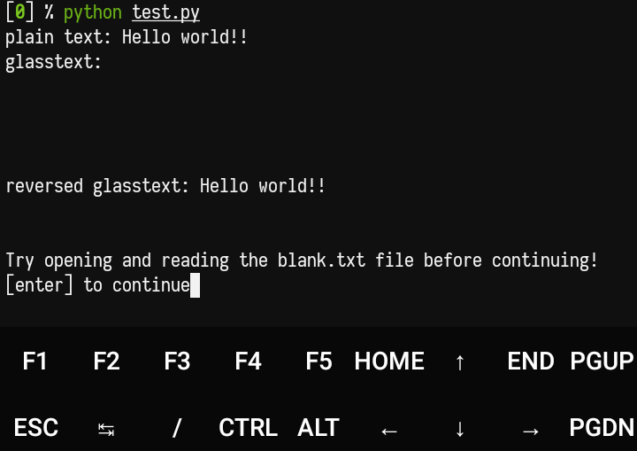

<h1 align="center"> glasstext </h1> 
<h4 align="center"> 
Python module for making invisible text
</h4>
<div align="center">  </div>


Glasstext converts a string to <kbd>spaces</kbd> and <kbd>tabs</kbd>. Make writing as if blank. It's like **whitespace programming language**.

The algorithm is very simple. The **string** is converted to **ascii decimal** then ascii decimal is converted to **binary** after the binary, number 0 is converted to a <kbd>space</kbd> and number 1 is converted to <kbd>tabs</kbd>.

----------------

Glasstext mengkonversi sebuah string menjadi <kbd>spasi</kbd> dan <kbd>tabs</kbd>. Membuat tulisan menjadi seolah-olah blank. Ini seperti **whitespace programing language**.

Algoritmanya sangatlah sederhana. **String** dikonversi ke **ascii decimal** lalu ascii decimal dikonversi ke **binary** setelah jadi binary, angka 0 diubah menjadi <kbd>spasi</kbd> dan angka 1 diubah menjadi <kbd>tabs</kbd>.

# Installing
Glasstext is not yet available in PyPi so if you want to use it just copy the glasstext folder into your project.

> To see examples of glasstext, try running `test.py`
> `python test.py`

# Documentation

After the glasstext folder is copied to your project folder, after that you import the glasstext module.
```python
from glasstext import glass
```

- **read(glasstext, rotate=False)**<br>
Reads the glasstext string into a plain text string

- **write(text, rotate=False)**<br>
Change plain text to glasstext

- **load(filename, rotate=False)**<br>
Load and read glasstext from a file into plain text

- **dump(text, filename, rotate=False)**<br>
Change the plain text into glasstext then make the file

> _Rotate parameter_ is to change/rotate the default binary output.
>
> default:
> - 0 is <kbd>space</kbd>
> - 1 is <kbd>tabs</kbd>


# Pros and Cons
- **Pros**<br>
Your string is invisible

- **Cons**<br>
Glasstext is very long string, because it is binary that changed to space and tabs